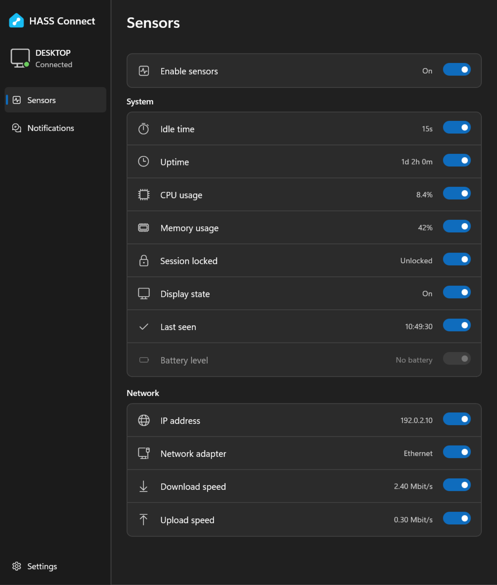

<p align="center">
  
</p>

<h1 align="center">HASS Connect</h1>

<p align="center">
  PC sensors and native Windows notifications for <a href="https://www.home-assistant.io/">Home Assistant</a>.
</p>

<p align="center">
  <a href="https://github.com/alphasixtyfive/HASSConnect/releases/latest"><strong>Download for Windows</strong></a>
  &nbsp; · &nbsp;
  <a href="docs/notifications.md">Notification examples</a>
  &nbsp; · &nbsp;
  <a href="https://github.com/alphasixtyfive/HASSConnect/issues">Report an issue</a>
</p>

Choose which sensors your PC reports and receive alerts with snapshots and action buttons.
HASS Connect runs in the tray and uses Home Assistant’s
[Mobile App integration](https://www.home-assistant.io/integrations/mobile_app/).
No MQTT broker or custom integration is required.

## Getting started

For Windows 11 x64. Download the installer from the [latest release](https://github.com/alphasixtyfive/HASSConnect/releases/latest).

Setup downloads the required Microsoft runtimes, so an internet connection is needed. This first release is unsigned, so Windows may show an unknown-publisher warning. Notifications do not require importing a certificate.

1. Run the installer, then open **HASS Connect** from Start.
2. Open **Settings**, enter your Home Assistant address and a long-lived access token, then connect.
3. Enable the sensors and notifications you want.

In Home Assistant, open your profile and select **Security** to create a long-lived access token.
Closing the window keeps the app in the tray. The tray menu also opens Home Assistant in your browser. Choose **Quit** to stop the app.



*Screenshot uses demo readings and an example network address.*

## Sensors

All sensors are off by default. Enabled sensors report every 15 seconds.

| Sensor | Reports |
| --- | --- |
| CPU usage | Processor use across all cores |
| Memory usage | Physical memory in use |
| Idle time | Time since keyboard or mouse input |
| Uptime | Time since Windows started |
| Session locked | Whether the current Windows session is locked |
| Display state | On, dimmed or off for the current session |
| Last seen | Timestamp of the latest report |
| Battery level | Charge remaining, where a battery is present |
| IP address | Local IPv4 address used to reach Home Assistant |
| Network adapter | Adapter used for that connection |
| Download / upload speed | Total traffic on that adapter, in Mbit/s |

Sensors can be disabled in either the app or HA. **Enable sensors** pauses reporting
without changing your selections. HA retains the last values while the PC is offline;
[Last seen can be used to detect stale reports](docs/sensors.md).

## Notifications

Enable notifications, then use the notify action created for your PC:

```yaml
action: notify.mobile_app_your_pc
data:
  message: Motion at the front door
  data:
    tag: front-door
    image: /media/local/camera/snapshots/front-door.jpg
    action_data:
      alert_id: front-door-001
    actions:
      - action: URI
        title: Open camera
        uri: /dashboard-cameras/front-door
      - action: CONFIRM_FRONT_DOOR
        title: Confirm
```

Use an existing snapshot and your dashboard’s path. Reusing a tag replaces the
previous alert. Action buttons return `mobile_app_notification_action` to HA with
the alert context; URI buttons open the browser.

[Notification examples](docs/notifications.md) cover clearing alerts, images and click events.
The app must be running and connected. Windows Do not disturb can suppress banners.

## Privacy and updates

Credentials are encrypted for your Windows account. Settings and logs stay in
`%LOCALAPPDATA%/HassConnect`. No location updates are sent. Home Assistant may create
a device tracker during registration; you can disable it.

The **Updates** section in Settings checks GitHub for a newer stable release and opens its release
page. Nothing is installed automatically.

[MIT License](LICENSE) · By [alphasixtyfive](https://github.com/alphasixtyfive)
