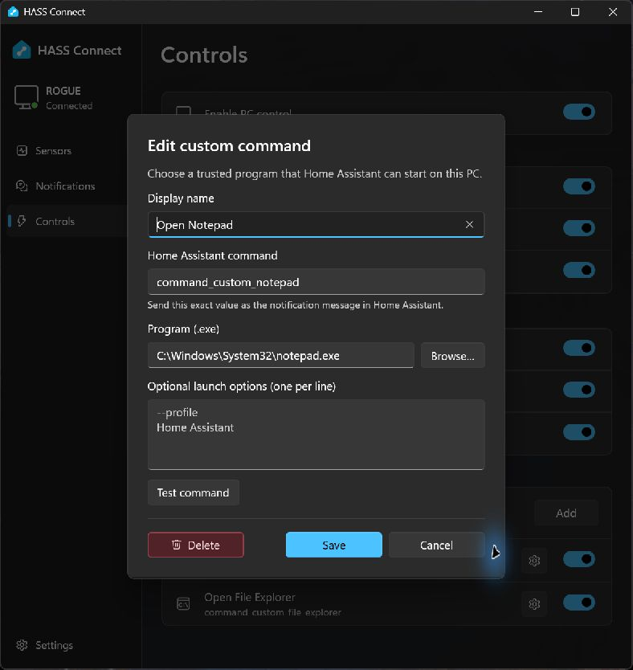

# Custom commands

Custom commands let Home Assistant start a program that you explicitly approve on the
Windows PC. Each command stores one local executable and a fixed list of arguments. An
incoming Home Assistant message can select the command, but it cannot change the program
or add arguments.

## Add a command

1. Open **Controls** and enable **PC control**.
2. Under **Custom commands**, select **Add**.
3. Enter a display name, Home Assistant command, local program and any fixed launch options.
4. Select **Test command** and confirm that the program behaves as expected.
5. Select **Add**, then leave the command's switch enabled.

Use the gear button beside an existing command to edit or delete it. The switch controls
whether Home Assistant may run that command without removing its configuration.



### Fields and limits

- **Display name:** 1–60 printable characters, used only inside HASS Connect.
- **Home Assistant command:** `command_custom_` followed by a lowercase letter and up to
  31 additional lowercase letters, numbers or underscores. It cannot be renamed after the
  command is created.
- **Program:** an existing absolute path to a local `.exe` file. Relative paths, network
  paths, symbolic links, reparse points and other file types are rejected.
- **Launch options:** zero to 16 fixed arguments, one per line. A line containing spaces is
  passed as one argument. Each argument can contain up to 512 printable characters, with a
  combined limit of 4,096 characters.

Up to 20 custom commands can be configured.

## Trigger it from Home Assistant

Replace `notify.mobile_app_your_pc` with the notify action created for this HASS Connect
device. The notification message must exactly match the saved command name:

```yaml
action: notify.mobile_app_your_pc
data:
  message: command_custom_open_notepad
```

No additional `data` is required or accepted by the custom command. Fixed arguments remain
on the PC and cannot be overridden remotely.

## Useful examples

These examples use executables included with Windows. Confirm the path on the target PC
before saving.

| Use | Program | Fixed launch options |
| --- | --- | --- |
| Open Notepad | `C:\Windows\System32\notepad.exe` | None |
| Open Calculator | `C:\Windows\System32\calc.exe` | None |
| Open a folder | `C:\Windows\explorer.exe` | The absolute folder path |

For a third-party application, use **Browse** to select its installed `.exe`. To run a
script, select a trusted interpreter as the program and store the script path as a fixed
argument. Do not configure interpreters or scripts that evaluate remote or user-controlled
content.

## Security model

- Commands are opt-in at three levels: PC control, the saved command, and its individual
  switch.
- The selected executable is validated when saved, tested and executed.
- HASS Connect starts the executable directly without a command shell or elevation. It runs
  as the signed-in Windows account.
- Home Assistant cannot supply executable paths or arguments.
- A command can start at most once every five seconds. All custom commands together can
  start at most ten times per minute.
- Unknown or disabled commands do not execute and are recorded in the diagnostic log.

Deleting a command immediately stops its Home Assistant message from working. Deletion
requires confirmation.

## Troubleshooting

- Confirm HASS Connect is running, connected, and **PC control** is enabled.
- Confirm the command's switch is enabled and the notification message matches exactly.
- Use **Test command** to separate local launch problems from Home Assistant automation
  problems.
- If the program was moved, use the gear button and select the new executable.
- Rapid repeated triggers are intentionally rate-limited; wait before testing again.
- Open **Settings > Diagnostic logs** for validation, launch and connection failures.

Built-in lock, display, sleep, media and volume messages are documented in the
[PC command reference](commands.md).
