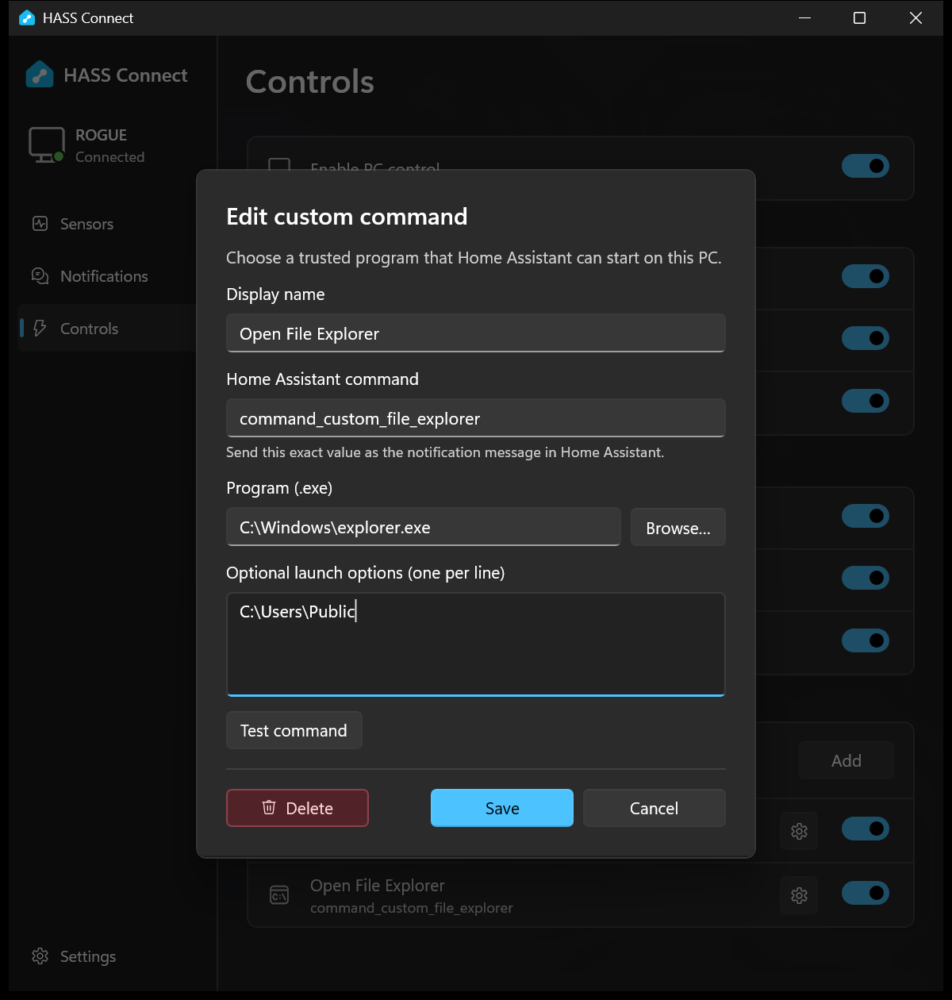

# Custom commands



Custom commands are for the PC actions that HASS Connect does not include out of the box.
You choose a program and, if needed, a fixed set of launch options. Home Assistant can run
that saved command, but it cannot change the program or its options.

## Add a command

1. Open **Controls** and enable **PC control**.
2. Under **Custom commands**, select **Add**.
3. Give it a friendly name and a Home Assistant command name.
4. Choose the program. Add fixed launch options only if the program needs them.
5. Select **Test command** and check that the right thing happens.
6. Select **Add**. Leave its switch on when you want Home Assistant to use it.

Use the gear button beside an existing command to edit or delete it. The switch controls
whether Home Assistant may run that command without removing it.

## What to enter

- **Display name** is the label shown in HASS Connect.
- **Home Assistant command** starts with `command_custom_`. After that, use a lowercase
  letter followed by lowercase letters, numbers or underscores. It cannot be renamed later.
- **Program** is the full path to a local `.exe`. Use **Browse** instead of typing the path
  when possible.
- **Launch options** are optional and fixed. Enter one argument per line; a line containing
  spaces is still passed as one argument.

HASS Connect accepts up to 20 commands and 16 launch options per command. It rejects
missing programs, network paths, shortcuts and symbolic links.

## Trigger it from Home Assistant

Replace `notify.mobile_app_your_pc` with the notify action created for this HASS Connect
device. The notification message must exactly match the saved command name:

```yaml
action: notify.mobile_app_your_pc
data:
  message: command_custom_open_notepad
```

That is the complete Home Assistant action. Do not add a program path or arguments to the
notification: HASS Connect ignores them and uses the values saved on the PC.

## Useful examples

These examples use programs included with Windows. Confirm the path on your PC before
saving.

| Use | Program | Fixed launch options |
| --- | --- | --- |
| Open Notepad | `C:\Windows\System32\notepad.exe` | None |
| Open Calculator | `C:\Windows\System32\calc.exe` | None |
| Open a folder | `C:\Windows\explorer.exe` | The absolute folder path |

For another application, use **Browse** and choose its installed `.exe`.

## What keeps it controlled

- Nothing runs until PC control and that command's switch are both enabled.
- HASS Connect checks the program when you save, test and run the command.
- The program starts directly as your Windows account—without a command shell or
  administrator elevation.
- Home Assistant cannot send a different program or extra arguments.
- Repeated triggers are rate-limited: once every five seconds for one command and ten
  starts per minute across all custom commands.
- Unknown and disabled commands do not run.

Deleting a command immediately stops its Home Assistant message from working. Deletion
requires confirmation.

## Troubleshooting

- Confirm HASS Connect is running, connected and **PC control** is enabled.
- Confirm the command's switch is enabled and the notification message matches exactly.
- Use **Test command** to separate local launch problems from Home Assistant automation
  problems.
- If the program was moved, use the gear button and select the new executable.
- Rapid repeated triggers are intentionally rate-limited; wait before testing again.
- Open **Settings > Diagnostic logs** for validation, launch and connection failures.

Built-in lock, display, sleep, media and volume messages are documented in the
[PC command reference](commands.md).
