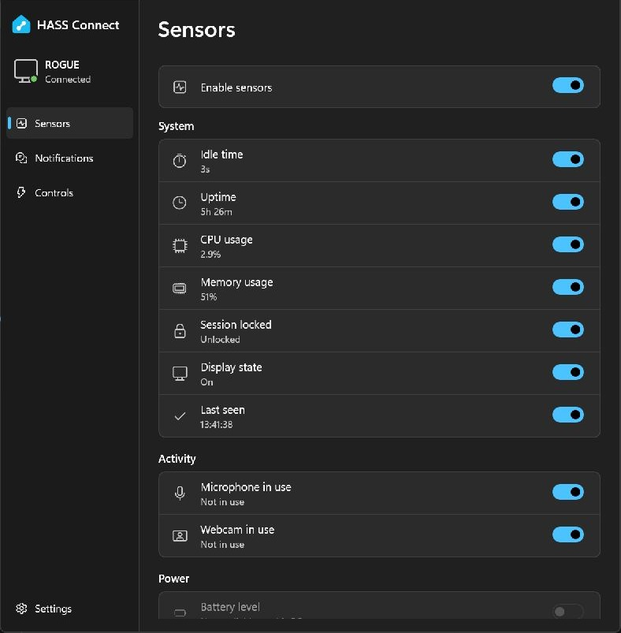

# Sensors



Sensors are individually opt-in. Enable sensors pauses collection while preserving
individual choices. Reports normally run every 15 seconds while awake and connected.

Display state reports `on`, `dimmed` or `off` for the current Windows session using
GUID_SESSION_DISPLAY_STATUS. It stays unknown until Windows supplies a value. This
does not detect individual monitor hardware switches.

Microphone and webcam activity come from Windows capability-use records for the
current user. The app does not inspect or transmit the application using them.

System disk readings describe the volume containing Windows. Free space is reported
in decimal gigabytes and usage as a percentage. Battery sensors are unavailable on
PCs where Windows reports no system battery.

## Guard automations against stale readings

Home Assistant retains the last CPU, idle and other readings when the PC sleeps,
the app closes or the connection drops. A low CPU value or a high idle time can
therefore remain frozen long after reporting stops.

Enable **Last seen** in HASS Connect alongside the sensors your automation uses.
Like every sensor, it is off by default. It reports the timestamp sampled for the
latest report and stops advancing when reporting stops, including when sensors
are paused. It does not automatically mark other entities unavailable.

Add this template condition to your automation's existing `conditions` list,
alongside its CPU or idle conditions. Replace `sensor.desktop_last_seen` with your
PC's actual entity ID:

```yaml
conditions:
  - condition: template
    alias: PC reported within the last 90 seconds
    value_template: >-
      {{ 0 <= as_timestamp(now()) - as_timestamp(states('sensor.desktop_last_seen'), 0) < 90 }}
```

This permits actions only when the timestamp is less than 90 seconds old.
Missing, `unknown`, `unavailable`, invalid or future timestamps fail the check.
The 90-second window allows several missed reports at the normal 15-second
interval; choose a shorter window if your automation needs fresher data.
It indicates recent reporting, not network reachability or whether every
individual sensor has a valid reading. Keep each sensor used by the automation
enabled and check its value too.

Conditions run when the automation reaches them. If your actions include a delay
or wait, repeat this condition after the wait and before the action that depends
on fresh readings. See Home Assistant's [template condition documentation](https://www.home-assistant.io/docs/scripts/conditions/#template-condition).

For a dashboard indicator, use the same expression in an HA template binary
sensor helper:

```jinja2
{{ 0 <= as_timestamp(now()) - as_timestamp(states('sensor.desktop_last_seen'), 0) < 90 }}
```

Helpers using `now()` refresh at the start of each minute, so the indicator can
lag behind the threshold. Use the direct condition above for the freshness check
at action time.
